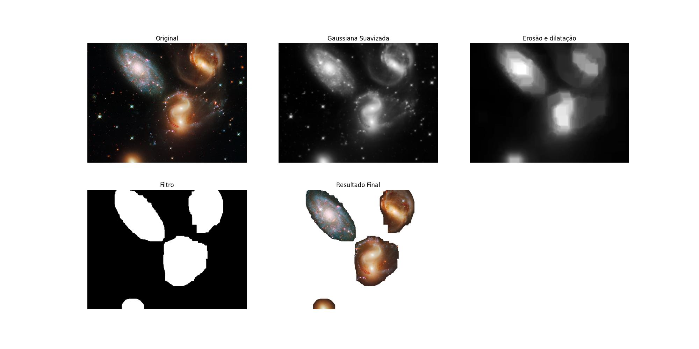

# EP - Processamento de imagens

Programa que processa algumas imagens astronômicas como galáxias e nebulosas, fazendo um recorte das regiões com mais foco de matéria  e removendo o fundo (com outras estrelas e galáxias) da imagem.

Todas as imagens processadas foram adquiridas no site da ESA-Hubble (https://esahubble.org/images/)

# Como executar

* Ativar o ambiente virtual (venv) que contém as dependências do projeto
* Executar o arquivo **main.py**

> source venv/bin/activate  
> python3 main.py

# Etapas do processamento da imagem

Detalhes de fundo das imagens são considerados ruídos e são removidos com a aplicação de alguns filtros. 
As seguintes operações são aplicadas em cada imagem:

1. Conversão da imagem de RGB para GRAYSCALE
2. Suavização Gaussiana
3. Erosão seguida de dilatação
4. Aplicação do thresholding
6. Segmentação da imagem original pelo filtro do thresholding

O programa irá processar todas as imagens contidas no diretório images/ e salvará cada imagem processada no diretório output/

# Exemplo de um processamento

