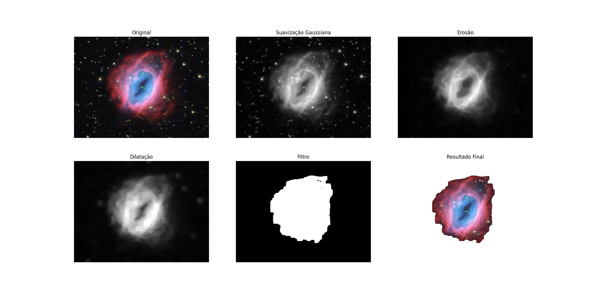
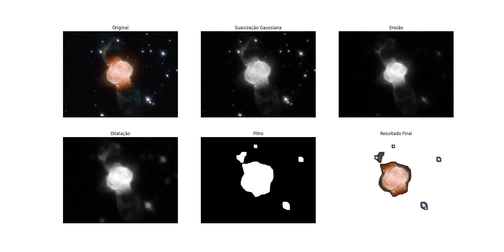
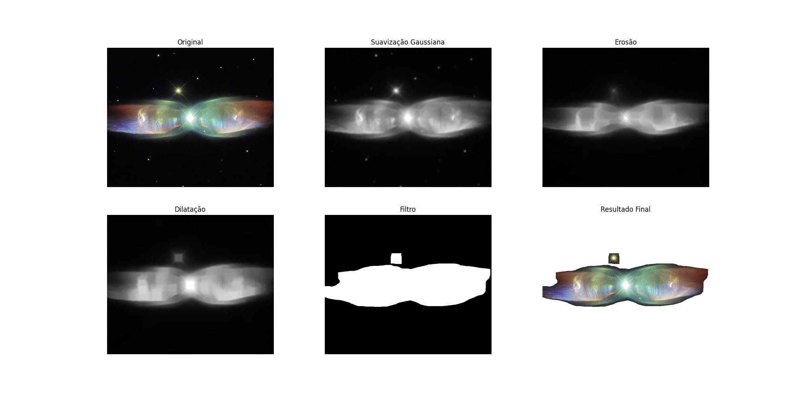

# EP - Processamento de imagens

## Proposta

Processar imagens astronômicas como galáxias e nebulosas, fazendo um recorte dessas regiões e removendo o fundo (com outras estrelas e galáxias) da imagem.

Todas as imagens processadas foram adquiridas no site da ESA-Hubble (https://esahubble.org/images/)

### APIs usadas

Para realizar o processamento das imagens utilizamos a biblioteca OpenCv para Python (https://opencv.org/).
Para abrir as imagens e plotá-las graficamente utilizamos a biblioteca Matplotlib (https://matplotlib.org/)

## Descrição do código-fonte

O código-fonte do EP está contido totalmente no arquivo main.py. As operações do programa estão organizadas em algumas funções: 
* **main()**: inicializa o programa, fazendo a leitura do diretório de imagens e processando individualmente cada uma.
* **process_image()**: realiza o processamento da imagem aplicando as operações de conversão para escala de cinza, suavização gaussiana, operação de erosão, operação de dilatação e thresholding().
* **plot_images()**: exibe as etapas de processamento da imagem e salva o resultado no diretório /output.

### Como executar

Basta executar o arquivo **main.py**, com as bibliotecas previamente instaladas. As dependências do programa estão especificadas no arquivo **requirements**.

As dependências podem ser instaladas através do **pip install**:
> pip install -r requirements

## Testes e resultados

Realizamos testes de imagens com pouco, médio e muitos ruídos. Realizamos testes com diferentes parâmetros para encontrar aqueles que, no geral, permitiram um bom resultado em todas as imagens.

### Parâmetros aplicados no processamento

* **Suavisazão gaussiana**: (15,15)
* **Erosão**: (25,25)
* **Dilatação**: (25,25)
* **Thresholding**: 40

### Etapas do processamento da imagem

Detalhes de fundo das imagens são considerados ruídos e são removidos com a aplicação de alguns filtros. 
As seguintes operações são aplicadas em cada imagem:

1. **Conversão da imagem de RGB para GRAYSCALE**
2. **Suavização gaussiana**: utilizada para suavizar e diminuir alguns pequenos ruídos de fundo.
3. **Aplicação da erosão**: utilizada para remover ruídos dentro da janela definida
4. **Aplicação da dilatação**: utilizado para restaurar detalhes da imagem que foram erodidos.
4. **Aplicação do thresholding**: para converter a imagem em escala preto-branco, de acordo com o limiar definido.
6. **Segmentação da imagem original**: plotagem do resultado do thresholding sobre a imagem original para separar a região de interesse.

### Exemplo de um processamento

O programa irá processar todas as imagens contidas no diretório images/ e salvará cada imagem processada no diretório output/.

#### Exemplos de bons resultados

Imagens em que foi possível separar todos os ruídos de fundo e segmentar somente a galáxia ou nebulosa da imagem original.

#### Exemplos de resultados ruins

Imagens em que não foi possível separar todos os ruídos de fundo e segmentar somente a galáxia ou nebulosa da imagem original, de acordo com os parâmetros definidos.

#### Exemplo sem suavização

A etapa de erosão em muitas imagens já demonstra uma ótima redução do ruído. Contudo, se for aplicada antes da suavização a imagem final perde um pouco de qualidade nos detalhes. Foi possível observar essa diferença nas duas imagens abaixo. Sem a suavização as bordas das regiões segmentadas ficam mais irregulares.

**Sem suavização**

**Com suavização**
